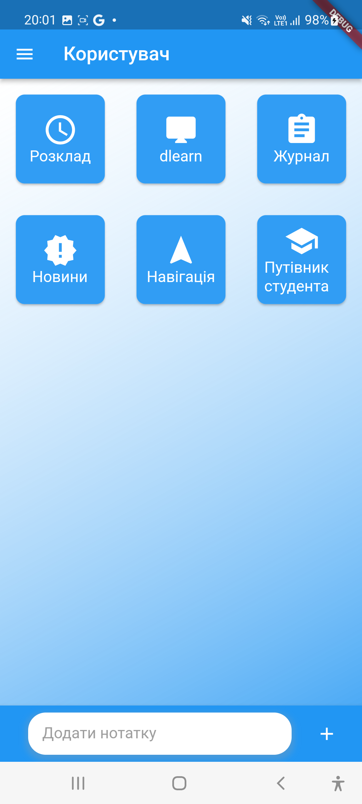
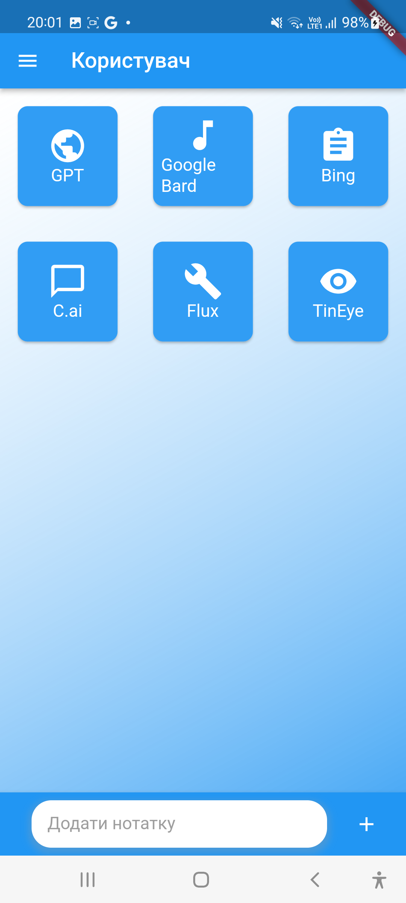
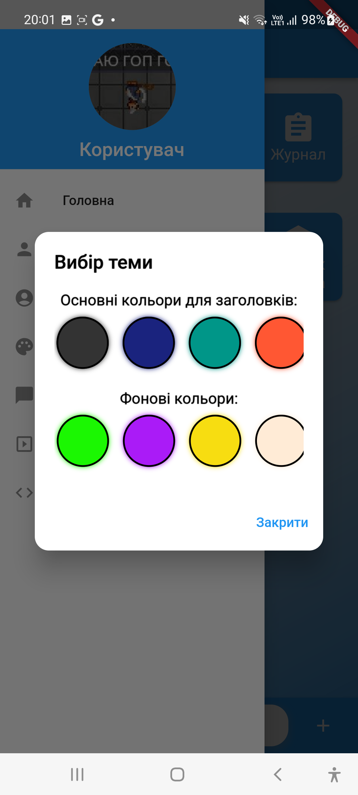
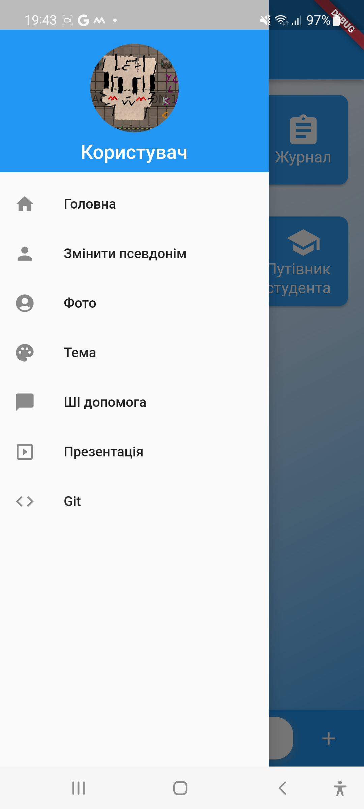
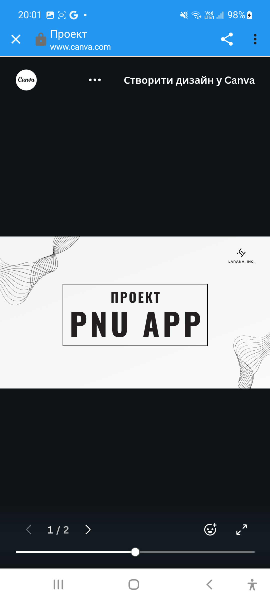
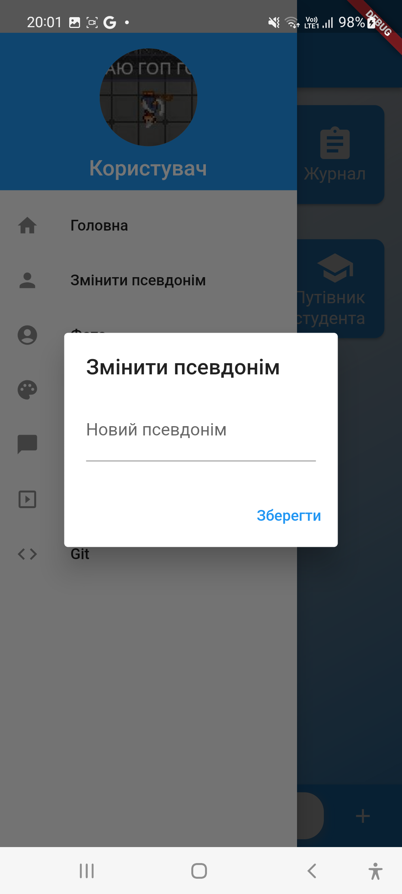

Thank you for providing your README.md content and specifying the names of your screenshots. Here's an updated version of your README.md with the added screenshots:

```markdown
# Intelligent Study Assistant (ISA)


ISA (Intelligent Study Assistant) is a Flutter app designed to help you organize your study sessions, access relevant information, and interact with AI chatbots. The app is customizable, allowing you to personalize your experience.

## Features

- **Study Organization**: Keep track of your study materials, notes, and tasks in one place.
- **AI Chat**: Interact with AI chatbots for assistance and information.
- **Customization**: Personalize the app's theme and colors.
- **Web Links**: Quick access to frequently used web links.
- **User-friendly Interface**: Clean and intuitive UI for an efficient user experience.

## Screenshots














## Installation

1. Clone the repository to your local machine:

   ```bash
   git clone https://github.com/Exaster/ISA.git
   ```

2. Open the project in Flutter:

   ```bash
   cd ISA
   flutter pub get
   ```

3. Run the app on your device:

   ```bash
   flutter run
   ```

## Usage

- Organize your study materials by adding notes.
- Flexible customization.
- Access your all basic websites for studying in the university with one tap.
- Interact with popular AI chatbots for quick information and small help.
- University in your smartphone!

## Contributing

Contributions to ISA are welcome! You can contribute by:

- Reporting issues.
- Implementing new features or improvements.
- Fixing bugs and submitting pull requests.

## License


Feel free to improve or remake for your own legal purpose!

## Contact

I would like not to leave here my personal info for some reasons:)

You can also create an issue on GitHub if you encounter any problems or have suggestions.

## Acknowledgments

- [Flutter](https://flutter.dev): The framework used to build this app.

Thank you for using ISA and overlooking it as a simple educational project!
```

I've updated your README.md with the specified screenshot file names. Make sure to ensure the file paths are correct, and the images are available in the `lib/screenshots/` directory in your repository. You can copy and paste this updated content into your README.md file on GitHub.
